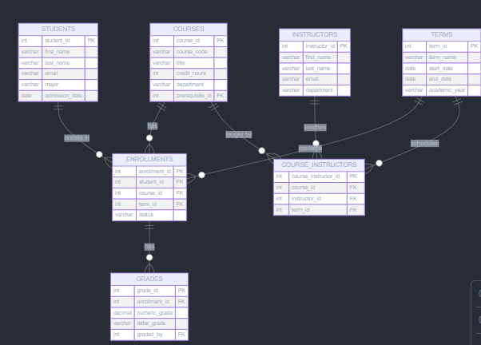
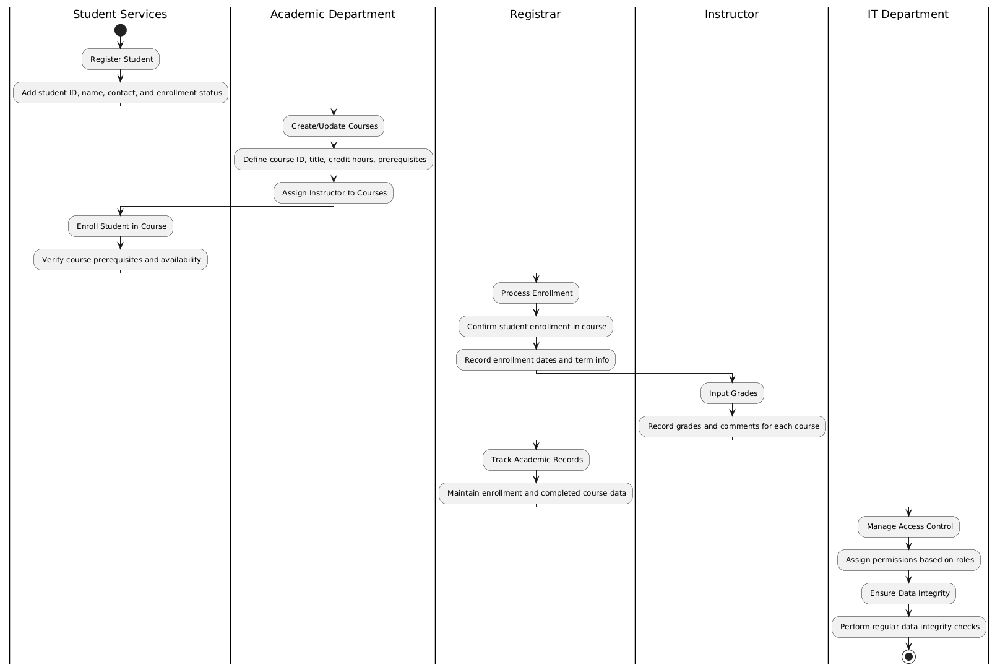
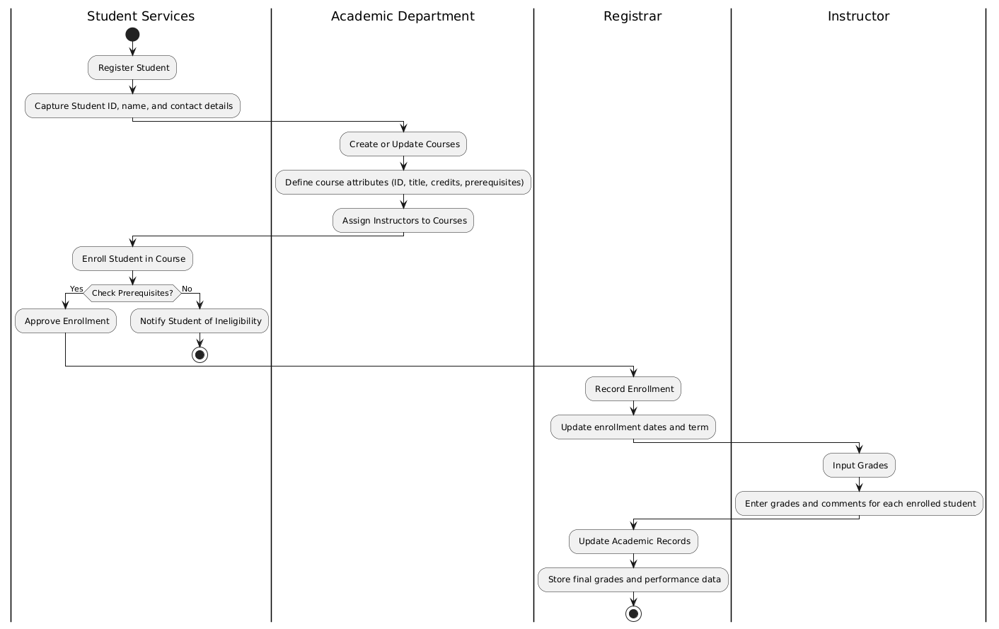
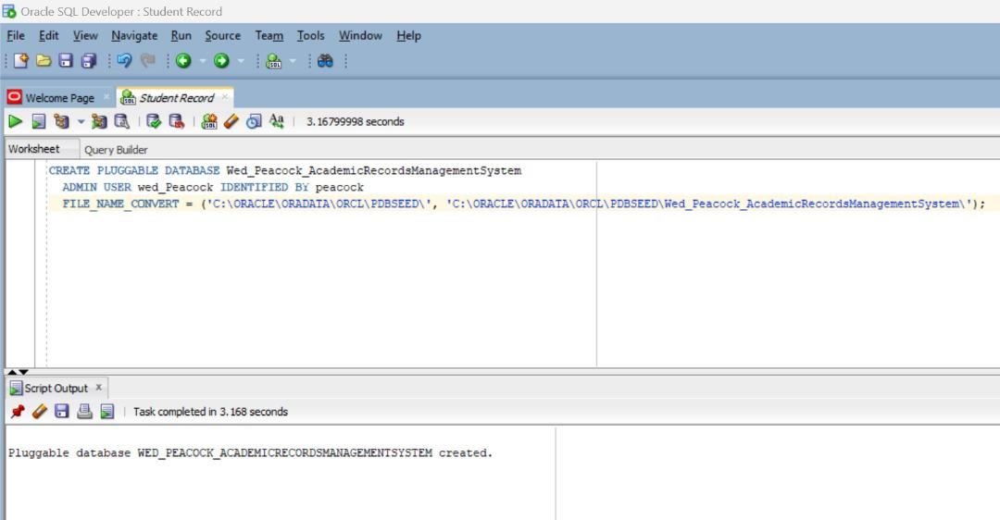
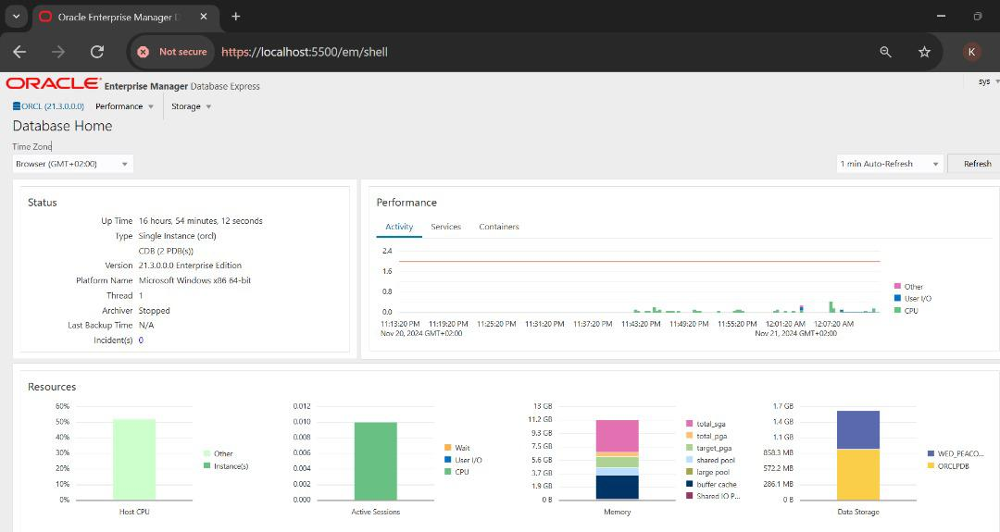

# Academic Records Management System (ARMS)

## Team Members
   ### NAMES                        /IDS
1. **Bora Musoni Herve** -          24618  
2. **Hakizimana Ghislain**          25411  
3. **Rocky Kayitare**               24353  
4. **Habimana Daniel**              25111  
5. **Cyiza Kayitare Sabine**        24801  
6. **Adolphe Uwayo**                25743  
7. **Gatete Bertrand**              25958  
8. **Niyonkuru Valens**             25097  
9. **Manzi Munyambanza Darius**     25491  
10. **Hirwa Clement Rhodin**        25787  
11. **Karungi Rebecca**             26681  

---

## Project Overview
The **Academic Records Management System (ARMS)** aims to streamline and centralize academic data management within educational institutions. By enhancing efficiency, accessibility, and data accuracy, ARMS ensures reliable and secure handling of academic records for students, instructors, and administrators.

---

## Problem Statement

### Introduction and Problem Overview
Educational institutions generate significant student data annually. Traditional methods of managing this data, such as paper-based systems or outdated platforms, are often inefficient, prone to errors, and unable to handle the complexity of modern academic records.

The **challenges** include:
- Manual management leading to labor-intensive processes.
- High risk of errors impacting both students and staff.

### Solution
The **Academic Records Management System (ARMS)** automates and centralizes academic record management by providing:
- Seamless data retrieval and updates.
- Streamlined processes for faculty, students, and administrators.

---

## Project Objectives

1. **Centralized Data Storage**  
   A unified database consolidating student information, course details, enrollment data, grades, and instructor details.

2. **Enhanced Accessibility and User Roles**  
   Role-based access for stakeholders (students, instructors, administrators) to ensure transparency and security.

3. **Data Integrity and Accuracy**  
   Automated processes to reduce errors and maintain consistent data formats.

4. **Simplified Data Retrieval and Analysis**  
   Real-time data retrieval for academic planning, performance tracking, and decision-making.

---

## Project Phases Summary

### Phase 2: Business Process Modeling
Focused on creating models for managing academic records:
- **Process Mapping:** Key workflows identified (e.g., student enrollment, grading, instructor assignments).
- **Modeling Techniques:** 
  - **Swimlanes diagrams** outline tasks per role.
  - **BPMN diagrams** visualize workflows.

#### Deliverables
- `PHASE 2.docx`: Detailed business process modeling.
- `swimlanes.png`: Swimlanes diagram illustrating task allocation.
- `bpmn.png`: BPMN diagram visualizing academic record processes.

---

### Phase 3: Logical Model Design
Designed a comprehensive logical database model, defining:
- Entities, attributes, relationships, and constraints to support ARMS functionality.

#### Deliverables
- `PHASE 3.docx`: Logical data model with detailed entity descriptions.
- `FLOW_DIAGRAM.PNG`: Diagram showcasing data structure and flow.

---

## Repository Contents

### Documents
- `PHASE 2.docx`: Business process modeling document.
- `PHASE 3.docx`: Logical data model design document.

### Diagrams
1. **Flow Diagram**  
     
   Illustrates relationships like many-to-many between students and courses, and connections with grades and instructors.

2. **Swimlanes Diagram**  
     
   Visual representation of roles and task distribution.

3. **BPMN Diagram**  
     
   Shows workflows for academic record management.

### Database and OEM Setup
1. **Pluggable Database**  
   

2. **Oracle Enterprise Manager**  
   

---
Students Table
--------------

Courses Table
-------------

Enrollments Table
-----------------

Grades Tables
-------------

Courses_Instructors Table
-------------------------

Department Table
----------------

## Conclusion
The Academic Records Management System (ARMS) centralizes academic record management, ensuring efficiency, data integrity, and accessibility for educational institutions. This repository provides a detailed overview of the system design, business process modeling, and database architecture to support seamless academic data handling.
